# 🏆 Easy Reward
A modern Android rewards application that aggregates multiple offer walls and payout options into a single, smooth user experience.

# 📋 Project Overview
RewardsApp allows users to:
- Register and authenticate securely.
- Complete offers from different ad networks.
- Earn points and redeem them for payouts.
- Track balances and transactions seamlessly.
The app integrates with a custom backend to handle authentication, balances, transactions, and payout requests using a token-based flow.

# 📸 Screenshots
| Login | Register | Forget Password |
| ------------ | ------------ | ------------ |
| 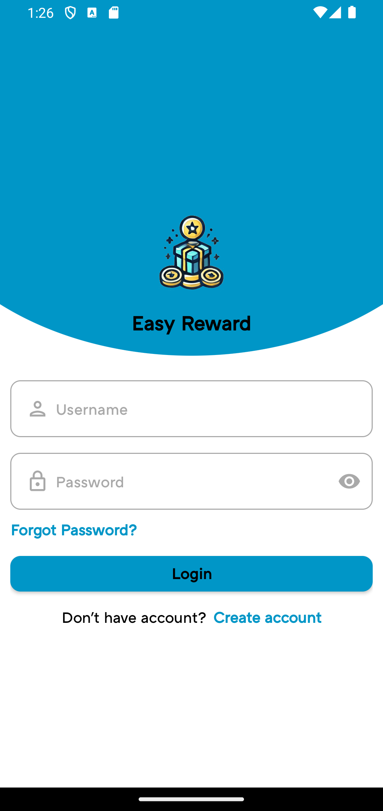 | 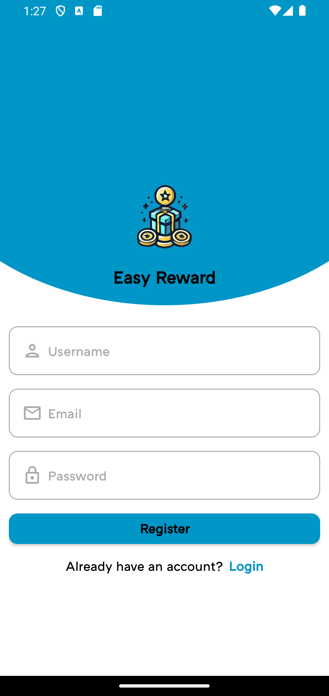 | 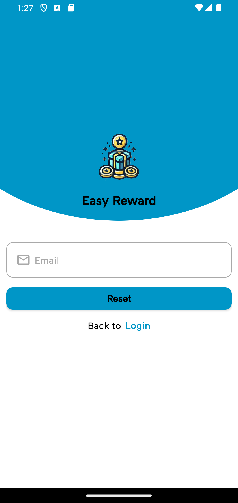 |

| Offers | Redeem | Transactions |
| ------------ | ------------ | ------------ |
| 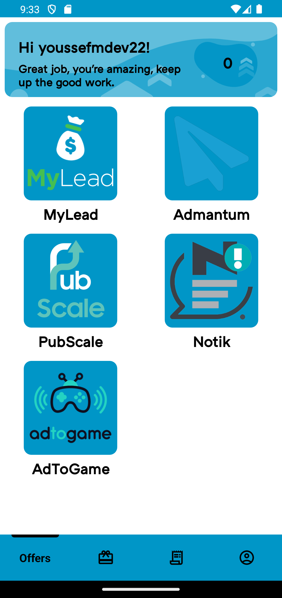 | 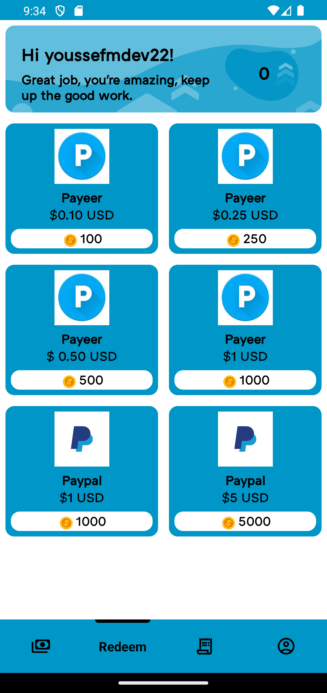 |  |

| Profile |
| ------------ |
| 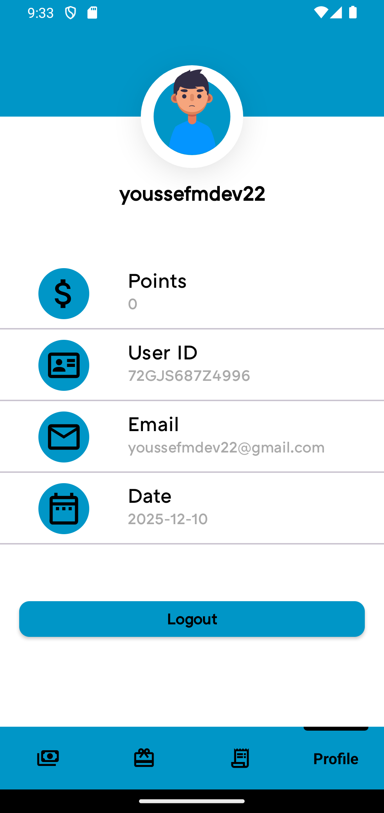 |

| Success Dialog | Warning Dialog | Error Dialog |
| ------------ | ------------ | ------------ |
| 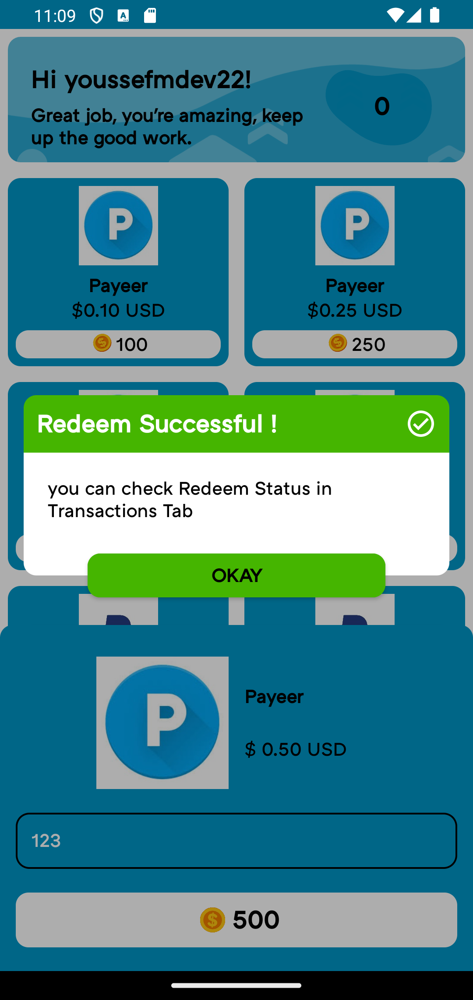 | 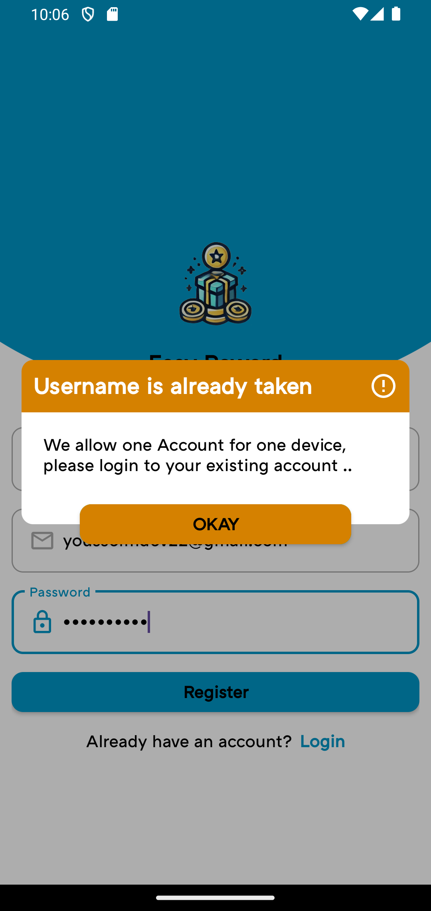 | 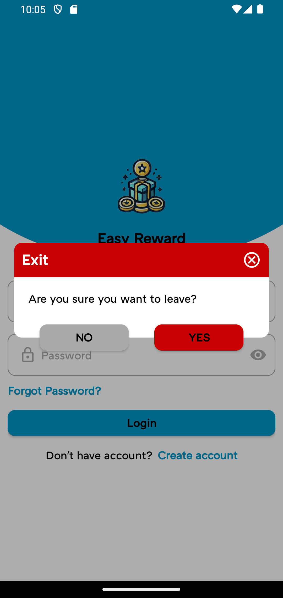 |

| Loading Dialog |
| ------------ |
| 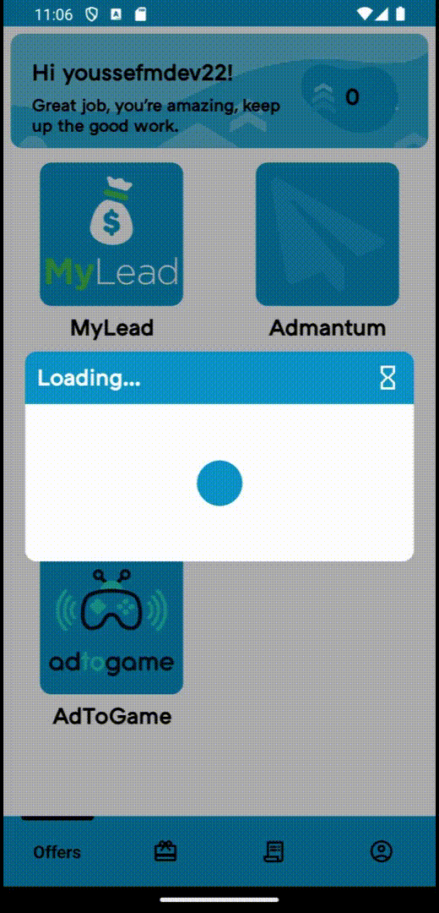 |

| Splash Screen | Page Transition | Container Transition |
| ------------ | ------------ | ------------ |
| 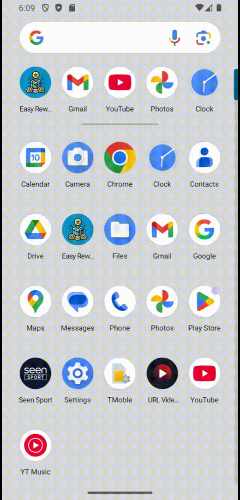 | 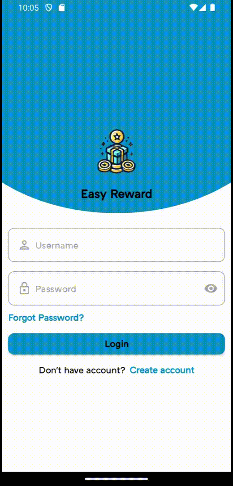 | 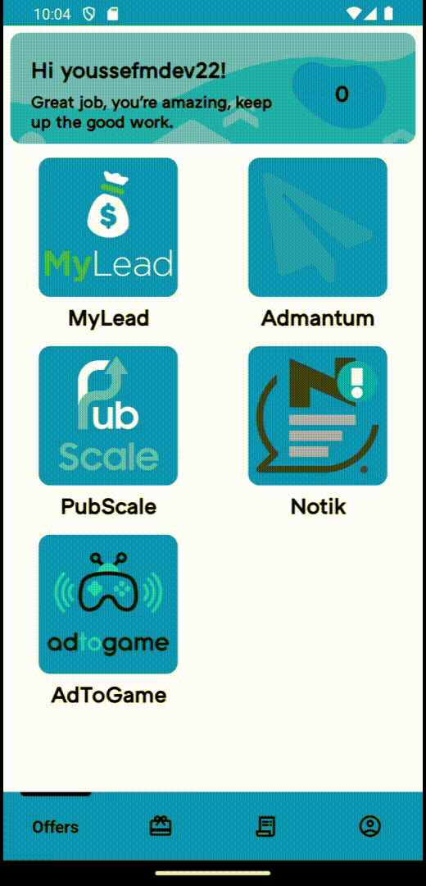 |

| Logout Transition |
| ------------ |
| 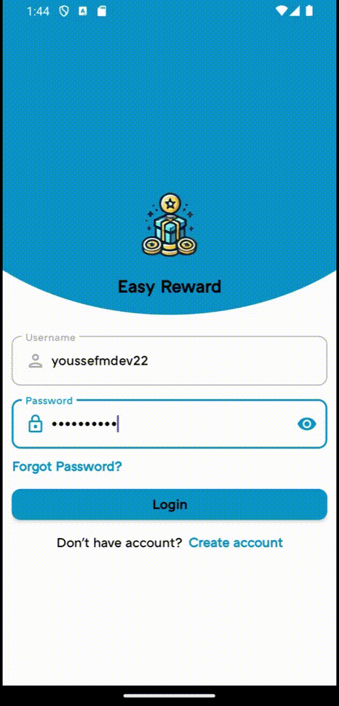 |

# 🛠️ Tech Stack
- Platform: Native Android (Java), AndroidX, MultiDex
- Networking: Retrofit2, Gson/GsonConverterFactory
- UI & UX: Material Components, MotionLayout, RecyclerView, ViewPager2, ViewBinding
- Animations & Feedback: Lottie animations, custom dialogs (success/error/warning/loading)
- Offer Walls / Ad Networks: Tapjoy SDK, PubScale OfferWall SDK, OGAds API, AdBlueMedia (ABM), EFlow offers API
- Utilities: SharedPreferences, validation helpers, network connectivity checks

# 🏗 Architecture
The app follows a layered modular structure:
| Layer | Responsibilities |
| ------------ | ------------ |
| UI | Activities (Splash, Auth, Main, OfferWall) & Fragments (Offers, Payout, Transactions, Profile). Handles navigation, animations, and user interaction. |
| Data/API | `ClientApi` defines backend and third-party endpoints via Retrofit |
| Domain/Models | POJOs under `models` for accounts, offers, payouts, transactions, and EFlow entities. |
| Core/App | `App` and `Constants` manage configuration, global Retrofit instance, session state, and error handling. |

Navigation is centered around MainActivity with MotionLayout entry animation, bottom bar, and ViewPager2 hosting the main feature fragments.

# ✨ Features
- Authentication & Session
- Sign up, login, password recovery, logout.
- Offers & Offer Walls
- Central "Offers" screen listing multiple sources.
- Dynamic handling of TapJoy, OGAds, ABM, PubScale, EFlow, and generic web walls.
- Points, Payouts & Transactions
- Live balance updates via ACCOUNT_BALANCE.
- Redeem flow with dialogs and transaction history (pending/approved/rejected).
- Profile & UX
- Profile screen with avatar animation, user details, and logout.
- Custom dialog system for feedback.
- Double-back-press exit confirmation.

# 📂 Folder Structure
```
app/
├── src/
│   ├── main/
│   │   ├── AndroidManifest.xml
│   │   ├── java/com/savezone/rewardsapp/
│   │   │   ├── App.java
│   │   │   ├── Constants.java
│   │   │   ├── api/           # Retrofit interfaces
│   │   │   ├── adapters/      # RecyclerView & ViewPager2 adapters
│   │   │   ├── lib/           # Custom UI components & dialogs
│   │   │   ├── models/        # Core models (offers, payouts, auth, etc.)
│   │   │   └── ui/
│   │   │       ├── auth/      # Login/Register/Recovery flows
│   │   │       ├── main/      # MainActivity + feature fragments
│   │   │       └── ...        # Offer wall activities
│   │   └── res/               # Layouts, drawables, styles, strings
```

# ▶️ How to Run the Project
Prerequisites
- Android Studio (Giraffe or newer).
- Recent Android SDK.
- Device/emulator with internet access.
- Valid API keys/credentials for backend & offer wall SDKs.
Setup
- Clone or download the project.
- Open in Android Studio and let Gradle sync.
- Configure keys in Constants.java and SDK meta-data in AndroidManifest.xml.
Run
- Select a device/emulator and press Run.
- App starts at SplashScreenActivity, then navigates to Auth or Main depending on session state.

# 🔗 Social Links
* GitHub: [youssefmdev22](https://github.com/youssefmdev22)
* LinkedIn: [youssefmdev](https://www.linkedin.com/in/youssefmdev/)
* Facebook: [youssefmdev](https://www.facebook.com/youssefmdev/)
* Email: [youssefmdev22@gmail.com](mailto:youssefmdev22@gmail.com)
